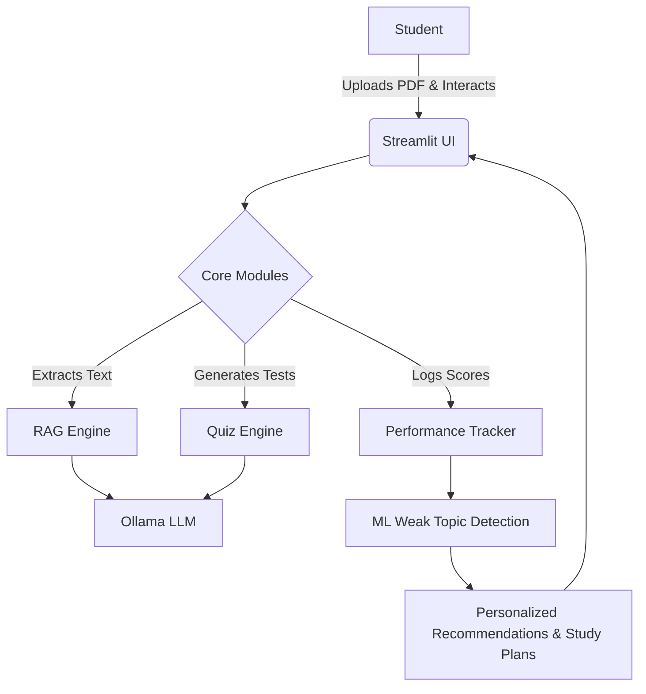

# 🎓 AI-Powered Study Assistant

> An intelligent, personalized learning assistant tailored for college students, leveraging modern LLMs and Machine Learning for a smarter study experience.


---

## 🌟 Key Features

- **📚 PDF Study Material Upload**: Securely upload your coursework and textbooks for analysis.
- **🤖 Intelligent RAG Q&A**: Ask questions directly about your study material and get precise, context-aware answers.
- **🧠 Local LLM Support (Ollama)**: Privacy-first processing using local Large Language Models.
- **📝 Dynamic Quiz Generation**: Automatically generate quizzes from your notes to test your knowledge.
- **📈 Performance Tracking**: Monitor your quiz scores and track your academic progress over time.
- **🔍 Weak Topic Detection**: Machine learning algorithms analyze your performance to identify areas needing improvement.
- **💡 Personalized Recommendations**: Receive tailored study advice and actionable recommendations.
- **📅 AI-Generated Study Plans**: Let the AI automatically schedule your study sessions based on your learning goals.

## 🛠️ Technology Stack

| Category | Technologies |
| :--- | :--- |
| **Frontend/UI** | Streamlit, Plotly |
| **AI/ML Engine** | Ollama, Scikit-learn, Sentence Transformers |
| **Vector DB / RAG** | FAISS, PyMuPDF |
| **Database** | SQLite |
| **Core Language**| Python |

## 📐 Architecture Overview



## 🚀 Getting Started

### Prerequisites

Ensure you have the following installed:
- **Python 3.8+**
- **[Ollama](https://ollama.ai/)** installed and running locally with your preferred model.

### Installation

1. **Clone the repository** (if you haven't already):
   ```bash
   git clone https://github.com/bhagyashreesajjan14/AI-Study-Assistant.git
   cd AI-Study-Assistant
   ```

2. **Create and activate a virtual environment**:
   ```bash
   python -m venv .venv
   
   # On Windows:
   .venv\Scripts\activate
   # On macOS/Linux:
   source .venv/bin/activate
   ```

3. **Install the dependencies**:
   ```bash
   pip install -r requirements.txt
   ```

4. **Run the Application**:
   ```bash
   streamlit run app.py
   ```

## 💡 Usage Guide

1. **Upload Documents**: Start by uploading your PDF study materials through the sidebar in the Streamlit app.
2. **Chat & Ask**: Navigate to the chat interface to ask questions about your documents. The AI will strictly answer based on the provided context.
3. **Take a Quiz**: Go to the Quiz section to automatically generate multiple-choice questions from your notes.
4. **View Analytics**: Check the Performance Dashboard to see your historical progress, identified weak topics, and AI-curated study plans.

---
*Built with ❤️ to make learning smarter.*
