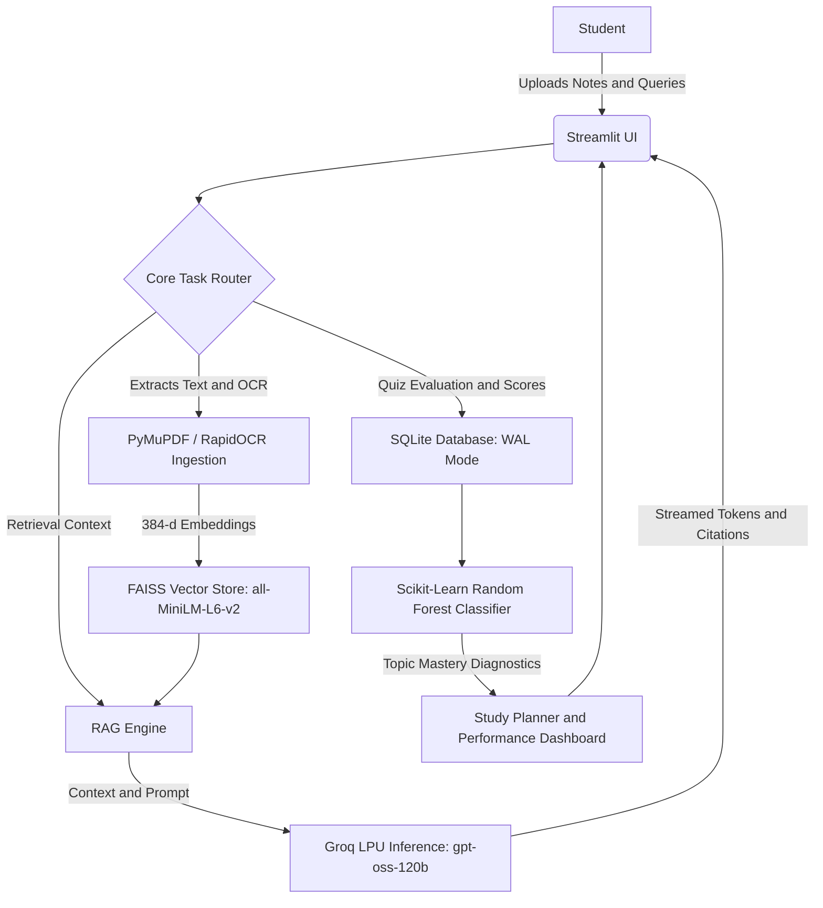

# AI-Powered Study Assistant

> An intelligent, personalized revision and learning platform tailored for college students, combining high-speed cloud LLM inference, local dense semantic retrieval, multimodal OCR, and ML performance diagnostics.


---

## Key Features

- **Multimodal Document Upload & OCR:** Ingests digital and scanned course materials including PDF, DOCX, TXT, MD, PNG, and JPG files using PyMuPDF and RapidOCR.
- **Citation-Grounded RAG Tutoring:** Performs semantic search over local FAISS vector stores with `sentence-transformers/all-MiniLM-L6-v2` embeddings. Provides token-streamed explanations with exact page-level citations through the Groq API using `openai/gpt-oss-120b`.
- **Study Material Hub:** Automatically synthesizes comprehensive study summaries, concept explanations, and interactive flashcards.
- **Dynamic Quiz Engine:** Generates schema-constrained multiple-choice quizzes across customizable difficulty tiers, with automated grading and detailed mistake explanations.
- **ML Diagnostic Weak Topic Detection:** Tracks historical student performance using a Scikit-Learn Random Forest Classifier to categorize topic mastery as Weak, Average, or Strong.
- **AI-Generated Study Plans and PDF Export:** Automatically designs personalized revision timetables and exports styled study notes, chat transcripts, and schedules as downloadable PDFs using ReportLab.
- **Asynchronous Non-Blocking Engine:** Uses background daemon worker threads and an SQLite WAL-mode state machine to keep the interface responsive during document indexing.

---

## Technology Stack

| Category | Technologies |
| :--- | :--- |
| **Frontend and UI** | Streamlit (1.30+), Plotly |
| **LLM Inference** | Groq API (`openai/gpt-oss-120b`) |
| **Vector Embeddings** | Hugging Face `sentence-transformers/all-MiniLM-L6-v2` using PyTorch CPU |
| **Vector Database and Indexing** | FAISS (`faiss-cpu`, normalized `IndexFlatIP`) |
| **Document Parsing and OCR** | PyMuPDF (`fitz`), RapidOCR (`rapidocr-onnxruntime`), python-docx |
| **Machine Learning Diagnostics** | Scikit-Learn (`RandomForestClassifier`), Pandas, NumPy |
| **Document Export Engine** | ReportLab |
| **Persistence and Concurrency** | SQLite3 using Write-Ahead Logging mode |
| **Core Language** | Python 3.10 / 3.11 |

---

## Architecture Overview



---

## Getting Started

### Prerequisites

Before you begin, make sure you have:

- Python 3.10 or 3.11 installed
- A valid Groq API key from [console.groq.com](https://console.groq.com)

### Installation

#### 1. Clone the repository

```bash
git clone https://github.com/bhagyashreesajjan14/AI-Study-Assistant.git
cd AI-Study-Assistant
```

#### 2. Create and activate a virtual environment

```bash
python -m venv .venv
```

**On Windows:**

```bash
.venv\Scripts\activate
```

**On macOS or Linux:**

```bash
source .venv/bin/activate
```

#### 3. Install dependencies

```bash
pip install -r requirements.txt
```

#### 4. Configure environment variables

Create a `.env` file in the root directory of the project:

```env
GROQ_API_KEY=your_groq_api_key_here
```

#### 5. Run the application

```bash
streamlit run app.py
```

After starting the application, Streamlit will open the Study Assistant in your browser.

---

## Usage Guide

### Register and Log In

Create an account to receive an isolated vector index and relational database session.

### Upload Documents

Upload course notes, textbooks, or scanned diagrams through the **Study Material** hub. The background worker parses documents, runs OCR when needed, and builds a FAISS vector index.

### Interactive AI Tutor

Ask syllabus-specific questions and receive real-time token-streamed answers grounded in your uploaded documents, including page-level citations.

### Take Adaptive Quizzes

Generate multiple-choice assessments tailored to your uploaded documents or custom topics. Choose a preferred difficulty level and receive grading with detailed explanations for incorrect answers.

### Analyze Weak Spots and Plan Study

Use the **Performance Dashboard** to view mastery classifications:

- Weak
- Average
- Strong

Generate personalized revision schedules based on quiz performance and topic-level mastery.

### Export Revision Guides

Download formatted study notes, chat transcripts, and multi-day study timetables as styled PDF files.

---

## License

This project is intended for educational purposes.
